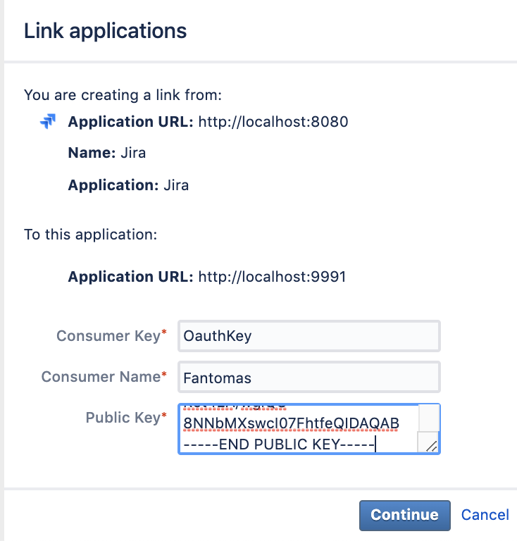
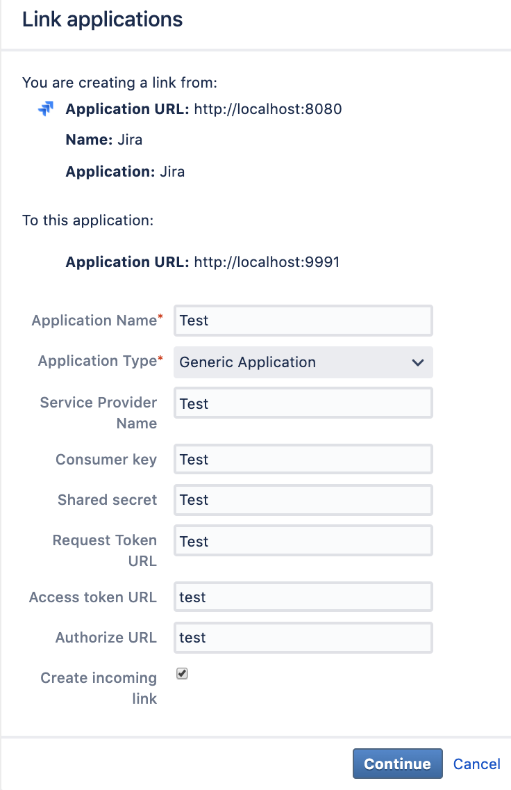

# Nodejs example of Jira OAuth using Passport

## Libraries
* [passport](http://www.passportjs.org/)
* [passport-atlassian-oauth](http://www.passportjs.org/packages/passport-atlassian-oauth/)

Here a tutorial for getting the required oauth keys and generating the Private key: 
https://developer.atlassian.com/server/jira/platform/oauth/#step-1-configure-jira

This example simulates a nodejs client retrieving JIRA projects via Oauth.  In this example express server is running on port 9991.

## Pre-requisites
* Generate an RSA public/private key pair
* Copy private key to the root of app's directory

* Configure Application Link:




* Use your consumerKey, private key file and jira server url in config.js

```
const config = {
  consumerKey: "OauthKey",
  consumerPrivateKeyFile: "./jira_privatekey.pem",
  jiraUrl: "http://0.0.0.0:5472" 
};

module.exports = config;
```

## Confirm it works
* ```npm start```
* go to /account, you will be redirected to login to Jira. 


